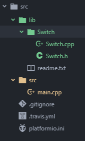
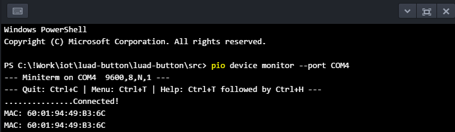
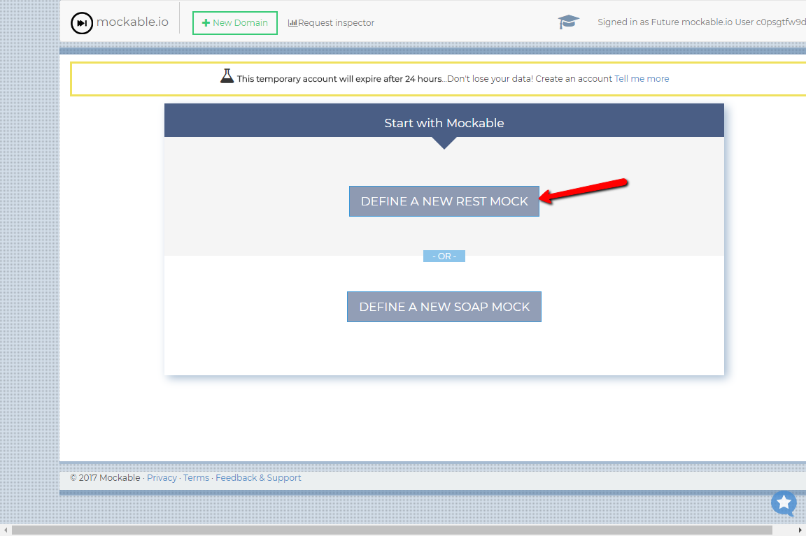
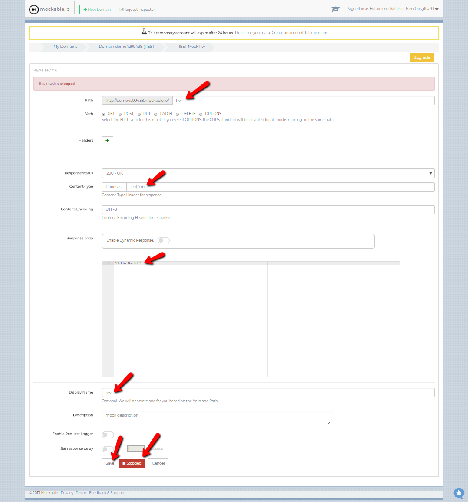
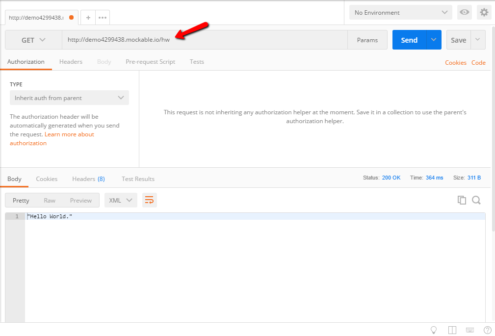
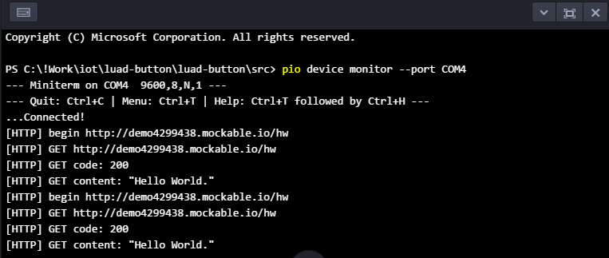
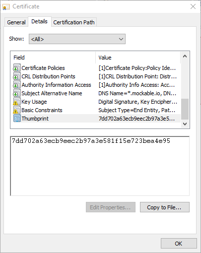
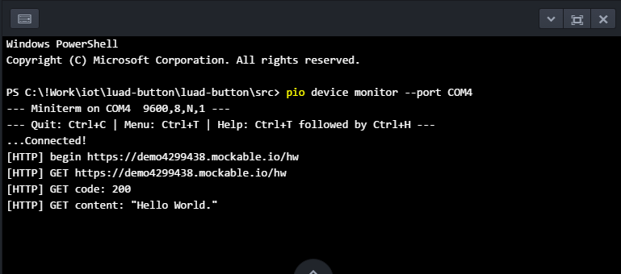

# luad-button

## 
W nawiązaniu do Gali IoT, która odbyła się 2017-12-02 na Błatniej, chciałbym rozwinąć temat i przedstawić przykładowe składowe rozwiazania problemu (tresc zadania: [tutaj](https://gitlab.jcommerce.pl/IoT/blatnia-2017-zadanie)). Tak, Tak nie zobaczycie tu całego rozwiązania, jedynie klocki z których możecie je poskładać :)
Poniżej przedstawię tochę informacji na temat samego sprzętu oraz jak rozwiązać poszczególne problemy zadania. Po przeanalizowaniu wszystkich elemetów będziecie w stanie samemu rozwiązać zadanie.

## Troche o hardware
Łukasz udostępnił wam urządzenie posiadające płyte główną [D1-Mini](https://wiki.wemos.cc/products:d1:d1_mini) oraz przycisk umieszczony w shield 1-BUTTON Shield v2.0.0. Sercem płyty głównej, z która mogliście się zmierzyć jest mikrokontroler [ESP8266](esp8266.md)

## Co musimy zrobić
* W wersji podstawowej zadania musimy:
0. [Uruchomić środowisko deweloperskie](#Dev)
1. [Zapalić diodę na urządzeniu](#Led)
2. [Podjać akcję po zdarzeniu double click](#Button)
3. [Podłączyć się do sieci WiFi](#WiFi)
4. [Wysłać request https](#Http)

## <a name="Dev"></a>Srodowisko developerskie
Rozwiązanie przedstawię przy użyciu [Atom](https://atom.io/)(alternatywnie można wybrać [VS Code](https://code.visualstudio.com/), jednak zdarzają się problemy) oraz [PlatformIO](http://platformio.org/).

Instalacja jest szybka i bezbolesna :D

- Instalujemy [Atom](https://atom.io/)
- Instalujemy [PlatformIO](http://docs.platformio.org/en/latest/ide/atom.html)

    
    

- Restart [Atom](https://atom.io/)

    

- Po restarcie i chwili ładowania powinniśmy zobaczyć ekran domowy [PlatformIO](http://docs.platformio.org/en/latest/ide/vscode.html)

    

- Tworzymy nowy projekt [PlatformIO](http://docs.platformio.org/en/latest/ide/atom.html)

    

- Wybieramy płytę [D1-Mini](https://wiki.wemos.cc/products:d1:d1_mini) oraz framework [Arduino](https://www.arduino.cc)

    

- <a name="Devices"></a>Podłączamy urządzenie (mrugnie niebieska dioda na urzadzeniu) i na liscie urządzeń możemy sprawdzić pod jakim portem COM nasze urządzenie jest dostępne

    

- Kompilujemy projekt, tak na wszelki wypadek żeby dociągnąć wszystkie zalećności i upewnić się, że wszystko działa

    

### <a name="code"></a>setup i loop
Zaglądamy do źródeł


``` c++
#include <Arduino.h>                    // Arduino framework reference

void setup() {
    // put your setup code here, to run once:
}

void loop() {
    // put your main code here, to run repeatedly:
}
```
* `setup()` - funkcja ta jest uruchamiana raz zaraz po starcie urządzenia
* `loop()` funkcja uruchamiana w pętli, po zakończeniu jej działania następuje ponowne jej uruchomienie

<a name="BuidUpload"></a>kompilujemy i wrzucamy na urządzenie, podczas uploadu dioda mruga szybko


### <a name="D1MiniLed"></a>Dioda na D1 Mini
[D1-Mini](https://wiki.wemos.cc/products:d1:d1_mini) ma wbudowaną diode, spróbujmy pomrugać diodą.
Aby ustawić sygnał wejściowy, musimy zainicjować odpowiedni pin jako OUTPUT. Stałe zawierające adresy pinow mozemy znaleźć [tutaj](https://wiki.wemos.cc/products:d1:d1_mini#pin). W naszym przypadku użyjemy `BUILTIN_LED` pod, którą kryje się `D4`, a finalnie [`GPIO2`](gpio.md) na [ESP8266](esp8266.md).
Kolejne stałe udostępnione przez framework to `HIGH` i `LOW`, które wykorzystamy do ustawienia stanu wyjścia.

``` c++
#include <Arduino.h>                    // Arduino framework reference

void setup() {
  pinMode(BUILTIN_LED, OUTPUT);         // setup led pin as output
}

void loop() {
  digitalWrite(BUILTIN_LED, HIGH);      // turn on led
  delay(1000);                          // wait 1 s
  digitalWrite(BUILTIN_LED, LOW);       // turn off led
  delay(1000);                          // wait 1 s
}

```

[Kompilujemy, wrzucamy](#BuidUpload) na urzadzenie. Po załadowaniu urządzenie się zrestartuje i program wystartuje. Po uruchomieniu programu możemy zaobserwować jednostajne mrugranie diody co 1s.


### <a name="HelloWorld"></a>Hello World via RS232
Z urzadzeń kompatybilnych z ludzkim interfejsem białkowym nasze urządzenie posiada jedynie diodę, możemy ją wykorzystać do informowania nas o stanie urzązenia. Jednak miganie diody dla początkującego programisty w świecie IoT to jednak trochę mało, teraz prześlijmy sobie tekst.

Do tego celu wykorzystamy komunikację szeregową (Serial Port). Nasze [D1-Mini](https://wiki.wemos.cc/products:d1:d1_mini) jest wyposażone w konwerter USB na RS232 i inne potrzebne uklady, dlatego po podłączeniu w systemie pojawi nam się nowy port [COM](#Devices)

Framework Arduino udestępnia nam narzędzie, klasę statyczną [Serial](https://www.arduino.cc/reference/en/language/functions/communication/serial/)

``` c++
#include <Arduino.h>                    // Arduino framework reference

void setup() {
  Serial.begin(9600);                   // setup port COM with bound 9600 bps
  while (!Serial) ;                     // wait for serial port
  Serial.print("Setup finished.");      // send text to COM
}

void loop() {
  Serial.printf("Loop begin\n");        // send text to COM
  delay(1000);                          // wait 1 s
  Serial.print("Loop end\n");           // send text to COM
}

```
<a name="Terminal"></a>[Kompilujemy, wrzucamy](#BuidUpload) na urządzenie i przełączamy się na terminal portu szeregowego


Widzimy jakie informacje płyną do nas z urzadzenia. [PlatformIO](http://platformio.org/) do połączeń RS używa python'owego [Miniterm](http://pyserial.readthedocs.io/en/latest/tools.html#module-serial.tools.miniterm), do tego celu można użyc innych narzędzi takich jak (Putty)[http://www.putty.org/], (TerraTerm)[https://ttssh2.osdn.jp/index.html.en].

Jeżeli używamy [VS Code](https://code.visualstudio.com/), pamiętajmy aby każdorazowo przed wrzucaniem nowej wersji oprogramowania rozłączyć teminal (Miniterm - CTRL+C), ponieważ nasz port komunikacyjny bedzie zajęty.


## <a name="Button"></a>Button clicked
[Shield](button-shield.md) który mamy w urządzeniu powoduje zwarcie portu D3 do masy, wiec po jego nacisnieciu powinnysmy na porcie D3 otrzynac stan niski (LOW)

``` c++
#include <Arduino.h>                    // Arduino framework reference

void setup() {
  pinMode(BUILTIN_LED, OUTPUT);         // setup led pin as output
  Serial.begin(9600);                   // setup port COM with bound 9600 bps
  while (!Serial) ;                     // wait for serial port
  pinMode(D3, INPUT);                   // setup button pis as input
}

void loop() {
  byte state = digitalRead(D3);         // read state of D3 pin
  if (LOW == state) {
    digitalWrite(BUILTIN_LED, HIGH);    // turn off led
  } else {
    digitalWrite(BUILTIN_LED, LOW);     // turn on led
  }
  Serial.println(state);                // sebd state to COM
}

```

[Kompilujemy, wrzucamy](#BuidUpload) na urzadzenie i przelaczamy sie na [terminal portu szeregowego](#Terminal), gdzie zobaczymy stan przycisku 
* 0 - wcisniety, dioda zgaszone
* 1 - nie wcisniety, dioda zapalona

### Button long press i double click
Widząc w jaki sposób sprawdzać stan możemy bawić się w zliczanie czasu ([millis()](https://www.arduino.cc/reference/en/language/functions/time/millis/) - zwraca liczbę milisekund od uruchomienia urządzenia) stanu wysokiego i czasu między kliknieciami, ale ktoś już to zrobil, dlatego użyjemy gotowca: [Switch](https://github.com/blackketter/Switch)

Pobieramy pliki Switch.cpp i Switch.h i zapisujemu w \<folder projektu>/lib/Switch ([szczegóły](src/lib/readme.txt))



``` c++
#include <Arduino.h>                    // Arduino framework reference
#include <Switch.h>                     // Switch reference

Switch button = Switch(D3, INPUT_PULLUP, LOW, 50, 3000);

void setup() {
  pinMode(BUILTIN_LED, OUTPUT);         // setup led pin as output
  Serial.begin(9600);                   // setup port COM with bound 9600 bps
  while (!Serial) ;                     // wait for serial port
}

void loop() {
   button.poll();
   if (button.longPress()) {
     Serial.println("LongPress");       // send state to COM
     digitalWrite(BUILTIN_LED, HIGH);   // turn off led
   }
   if (button.doubleClick()) {
     Serial.println("DoubleClick");     // send state to COM
     digitalWrite(BUILTIN_LED, LOW);    // turn on led
   }
}

```
[Kompilujemy, wrzucamy](#BuidUpload) na urzadzenie i przelaczamy sie na [terminal portu szeregowego](#Terminal), gdzie zobaczymy status

## <a name="Wifi"></a>WiFi
Teraz połączmy się z siecią wifi, przy okazji poznamy adres MAC urządzenia. 
W tym celu użyjemy modułu ESP8266WiFi

``` c++
#include <Arduino.h>                    // Arduino framework reference
#include <ESP8266WiFi.h>                // WiFi module reference

const char* ssid = "";                  // WiFi SSID
const char* password = "";              // WiFi Password

void wifiConnect();                     // Method declaration
String mac;                             // MAC address variable

void setup() {
  Serial.begin(9600);                   // setup port COM with bound 9600 bps
  while (!Serial) ;                     // wait for serial port
  wifiConnect();                        // connect to WiFi
}

void loop() {
  Serial.print("MAC: ");
  Serial.println(mac);                  // send MAC address to COM
  delay(1000);                          // wait 1 s
}

void wifiConnect(){
  Serial.print("Connecting to ");
  Serial.print(ssid);
  WiFi.disconnect();                    // ensure that WiFi is disconected
  WiFi.mode(WIFI_STA);                  // set WiFi mode as client
  WiFi.begin(ssid, password);           // begin connection process

  while (WiFi.status() != WL_CONNECTED) {
    delay(300);
    Serial.print(".");
  }                                     // wait until WiFi is connected

  mac = WiFi.macAddress();              // read device MAC address

  Serial.println("Connected!");
}

```
[Kompilujemy, wrzucamy](#BuidUpload) na urzadzenie i przelaczamy sie na [terminal portu szeregowego](#Terminal), gdzie mozemy zobaczyc adres MAC urzadzenia.



Znając MAC adres naszej karty sieciowej możemy użyc [Postman](https://www.getpostman.com/) lub [curl][https://curl.haxx.se/] do zawołania adresu z [tresci zadania](https://gitlab.com/net-summit-2017/esp.task)

## <a name="Http"></a>Call to another world

Prosty endpoint do testów możemy utworzyć w [mockable.io](https://www.mockable.io/)


Tworzymy mock serwisu rest'owego



Konfigurujemy naszego mocka'a



Możemy przetestować [Postman](https://www.getpostman.com/)'em



Mamy testowy endpoint i wiemy już jak podłączyć się do [WiFi](#Wifi), więc spróbujmy zawołać zewnętrzny server.

Z pomocą przychodzi nam modul [ESP8266HTTPClient](https://github.com/esp8266/Arduino/tree/master/libraries/ESP8266HTTPClient).
``` c++
#include <Arduino.h>                    // Arduino framework reference
#include <ESP8266WiFi.h>                // WiFi module reference
#include <ESP8266HTTPClient.h>          // HTTP Client module reference

String getRequest(String endpoint);     // Method declaration

void setup() {
  Serial.begin(9600);                   // setup port COM with bound 9600 bps
  while (!Serial) ;                     // wait for serial port
  wifiConnect();                        // connect to WiFi
}

void loop() {
  getRequest("http://demo4299438.mockable.io/hw");
  delay(30000);
}

String getRequest(String endpoint){
  HTTPClient http;
  Serial.printf("[HTTP] begin %s\n", endpoint.c_str());
  http.begin(endpoint);

  Serial.printf("[HTTP] GET %s\n", endpoint.c_str());
  int httpCode = http.GET();
  // httpCode will be negative on error
  if(httpCode > 0) {
    // HTTP header has been send and Server response header has been handled
    Serial.printf("[HTTP] GET code: %d\n", httpCode);

    if(httpCode == HTTP_CODE_OK) {
        String content = http.getString();
        Serial.printf("[HTTP] GET content: %s\n", content.c_str());
        return content;
    }

  } else {
      Serial.printf("[HTTP] GET failed, error: %s\n", http.errorToString(httpCode).c_str());
  }
}

```

[Kompilujemy, wrzucamy](#BuidUpload) na urzadzenie i przelaczamy sie na [terminal portu szeregowego](#Terminal), może zobaczyć adres wolanego endpoint oraz infomacje zwrotne



### HTTPS
Aby nawiązać połączenie https, wystarczy zmienić adres na `https` i do metody `begin` przekazać dodatkowy parametr zawierający "odcisk palca", który odczytamy ze szczegółów certyfikatu ssl



``` c++
#include <Arduino.h>                    // Arduino framework reference
#include <ESP8266WiFi.h>                // WiFi module reference
#include <ESP8266HTTPClient.h>          // HTTP Client module reference

String getRequest(String endpoint);     // Method declaration

void setup() {
  Serial.begin(9600);                   // setup port COM with bound 9600 bps
  while (!Serial) ;                     // wait for serial port
  wifiConnect();                        // connect to WiFi
}

void loop() {
  getRequest("https://demo4299438.mockable.io/hw");
  delay(30000);
}

String getRequest(String endpoint){
  HTTPClient http;
  String fingerPrint = "7dd702a63ecb9eec2b97a3e581f15e723bea4e95";
  Serial.printf("[HTTP] begin %s\n", endpoint.c_str());
  http.begin(endpoint, fingerPrint);

  Serial.printf("[HTTP] GET %s\n", endpoint.c_str());
  int httpCode = http.GET();
  // httpCode will be negative on error
  if(httpCode > 0) {
    // HTTP header has been send and Server response header has been handled
    Serial.printf("[HTTP] GET code: %d\n", httpCode);

    if(httpCode == HTTP_CODE_OK) {
        String content = http.getString();
        Serial.printf("[HTTP] GET content: %s\n", content.c_str());
        return content;
    }

  } else {
      Serial.printf("[HTTP] GET failed, error: %s\n", http.errorToString(httpCode).c_str());
  }
}

```

[Kompilujemy, wrzucamy](#BuidUpload) na urzadzenie i przelaczamy sie na [terminal portu szeregowego](#Terminal), może zobaczyć adres wolanego endpoint oraz infomacje zwrotne




## Podsumowanie
Już wiemy jak wykonać podstawowe operacje z wykorzystaniem układu [ESP8266](esp8266.md).

Teraz rozwiązanie zadania zaproponowanego przez Łukasza nie powinno sprawić wiekszego problem.

W razie pytań wiecie, gdzie nas znaleźć :)


