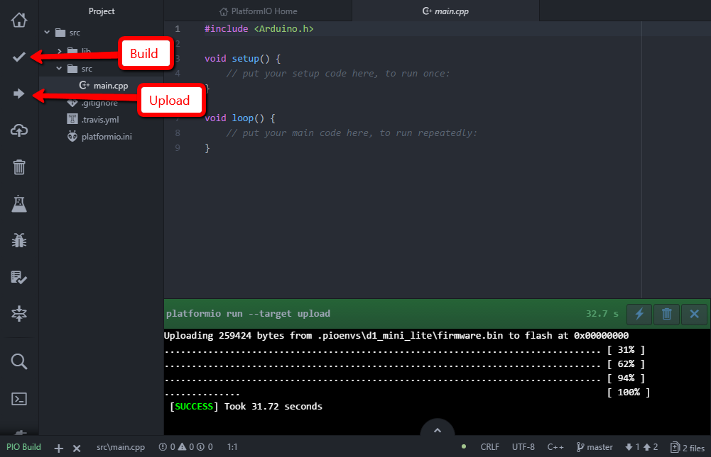
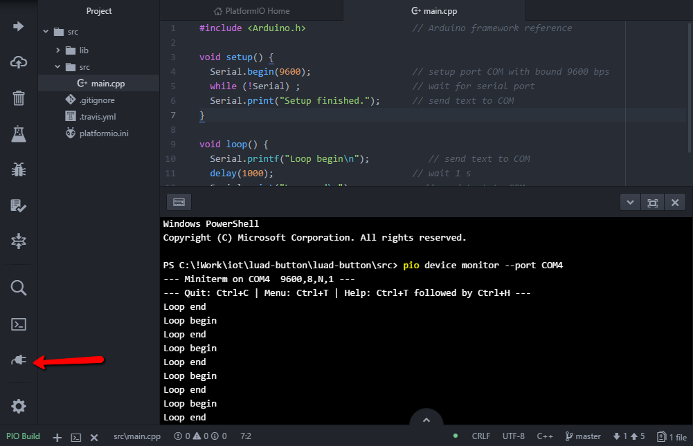
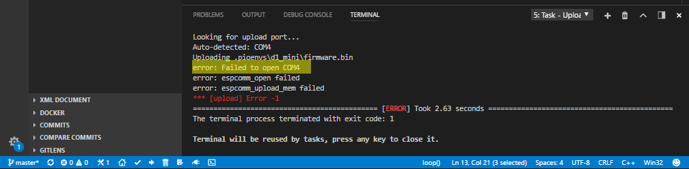

# luad-button

## 
W nawiązaniu do Gali IoT, która odbyła się 2017-12-02 na Błatniej, chciałbym rozwinąć temat i przedstawić przykładowe składowe rozwiazania problemu (tresc zadania: [tutaj](https://gitlab.jcommerce.pl/IoT/blatnia-2017-zadanie)). Tak, Tak nie zobaczycie tu całego rozwiązania, jedynie klocki z których możecie je poskładać :)
Poniżej przedstawię tochę informacji na temat samego sprzętu oraz jak rozwiązać poszczególne problemy zadania. Po przeanalizowaniu wszystkich elemetów będziecie w stanie samemu rozwiązać zadanie.

## Troche o hardware
Łukasz udostępnił wam urządzenie posiadające płyte główną [D1-Mini](https://wiki.wemos.cc/products:d1:d1_mini) oraz przycisk umieszczony w shield 1-BUTTON Shield v2.0.0. Sercem płyty głównej, z która mogliście się zmierzyć jest mikrokontroler [ESP8266](esp8266.md)

## Co musimy zrobić
* W wersji podstawowej zadania musimy:
0. [Uruchomić środowisko deweloperskie](#Dev)
1. [Zapalić diodę na urządzeniu](#Led)
2. [Podjać akcję po zdarzeniu double click](#Button)
3. [Podłączyć się do sieci WiFi](#WiFi)
4. [Wysłać request https](#Http)

## <a name="Dev"></a>Srodowisko developerskie
Rozwiązanie przedstawię przy użyciu [Atom](https://atom.io/)(alternatywnie można wybrać [VS Code](https://code.visualstudio.com/), jednak zdarzają się problemy) oraz [PlatformIO](http://platformio.org/).

Instalacja jest szybka i bezbolesna :D

- Instalujemy [Atom](https://atom.io/)
- Instalujemy [PlatformIO](http://docs.platformio.org/en/latest/ide/atom.html)

    
    

- Restart [Atom](https://atom.io/)

    

- Po restarcie i chwili ładowania powinniśmy zobaczyć ekran domowy [PlatformIO](http://docs.platformio.org/en/latest/ide/vscode.html)

    

- Tworzymy nowy projekt [PlatformIO](http://docs.platformio.org/en/latest/ide/atom.html)

    

- Wybieramy płytę [D1-Mini](https://wiki.wemos.cc/products:d1:d1_mini) oraz framework [Arduino](https://www.arduino.cc)

    

- <a name="Devices"></a>Podłączamy urządzenie (mrugnie niebieska dioda na urzadzeniu) i na liscie urządzeń możemy sprawdzić pod jakim portem COM nasze urządzenie jest dostępne

    

- Kompilujemy projekt, tak na wszelki wypadek żeby dociągnąć wszystkie zalećności i upewnić się, że wszystko działa

    

### <a name="code"></a>setup i loop
Zaglądamy do źródeł


``` c++
#include <Arduino.h>                    // Arduino framework reference

void setup() {
    // put your setup code here, to run once:
}

void loop() {
    // put your main code here, to run repeatedly:
}
```
* `setup()` - funkcja ta jest uruchamiana raz zaraz po starcie urządzenia
* `loop()` funkcja uruchamiana w pętli, po zakończeniu jej działania następuje ponowne jej uruchomienie

<a name="BuidUpload"></a>kompilujemy i wrzucamy na urządzenie, podczas uploadu dioda mruga szybko



### <a name="D1MiniLed"></a>Dioda na D1 Mini
[D1-Mini](https://wiki.wemos.cc/products:d1:d1_mini) ma wbudowaną diode, spróbujmy pomrugać diodą.
Aby ustawić sygnał wejściowy, musimy zainicjować odpowiedni pin jako OUTPUT. Stałe zawierające adresy pinow mozemy znaleźć [tutaj](https://wiki.wemos.cc/products:d1:d1_mini#pin). W naszym przypadku użyjemy `BUILTIN_LED` pod, którą kryje się `D4`, a finalnie [`GPIO2`](gpio.md) na [ESP8266](esp8266.md).
Kolejne stałe udostępnione przez framework to `HIGH` i `LOW`, które wykorzystamy do ustawienia stanu wyjścia.

``` c++
#include <Arduino.h>                    // Arduino framework reference

void setup() {
  pinMode(BUILTIN_LED, OUTPUT);         // setup led pin as output
}

void loop() {
  digitalWrite(BUILTIN_LED, HIGH);      // turn on led
  delay(1000);                          // wait 1 s
  digitalWrite(BUILTIN_LED, LOW);       // turn off led
  delay(1000);                          // wait 1 s
}

```

[Kompilujemy, wrzucamy](#BuidUpload) na urzadzenie. Po załadowaniu urządzenie się zrestartuje i program wystartuje. Po uruchomieniu programu możemy zaobserwować jednostajne mrugranie diody co 1s.


### <a name="HelloWorld"></a>Hello World via RS232
Z urzadzeń kompatybilnych z ludzkim interfejsem białkowym nasze urządzenie posiada jedynie diodę, możemy ją wykorzystać do informowania nas o stanie urzązenia. Jednak miganie diody dla początkującego programisty w świecie IoT to jednak trochę mało, teraz prześlijmy sobie tekst.

Do tego celu wykorzystamy komunikację szeregową (Serial Port). Nasze [D1-Mini](https://wiki.wemos.cc/products:d1:d1_mini) jest wyposażone w konwerter USB na RS232 i inne potrzebne uklady, dlatego po podłączeniu w systemie pojawi nam się nowy port [COM](#Devices)

Framework Arduino udestępnia nam narzędzie, klasę statyczną [Serial](https://www.arduino.cc/reference/en/language/functions/communication/serial/)

``` c++
#include <Arduino.h>                    // Arduino framework reference

void setup() {
  Serial.begin(9600);                   // setup port COM with bound 9600 bps
  while (!Serial) ;                     // wait for serial port
  Serial.print("Setup finished.");      // send text to COM
}

void loop() {
  Serial.printf("Loop begin\n");        // send text to COM
  delay(1000);                          // wait 1 s
  Serial.print("Loop end\n");           // send text to COM
}

```
<a name="Terminal"></a>[Kompilujemy, wrzucamy](#BuidUpload) na urządzenie i przełączamy się na terminal portu szeregowego



Widzimy jakie informacje płyną do nas z urzadzenia. [PlatformIO](http://platformio.org/) do połączeń RS używa python'owego [Miniterm](http://pyserial.readthedocs.io/en/latest/tools.html#module-serial.tools.miniterm), do tego celu można użyc innych narzędzi takich jak (Putty)[http://www.putty.org/], (TerraTerm)[https://ttssh2.osdn.jp/index.html.en].

Jeżeli używamy [VS Code](https://code.visualstudio.com/), pamiętajmy aby każdorazowo przed wrzucaniem nowej wersji oprogramowania rozłączyć teminal (Miniterm - CTRL+C), ponieważ nasz port komunikacyjny bedzie zajęty.



## <a name="Button"></a>Button clicked
[Shield](button-shield.md) który mamy w urządzeniu powoduje zwarcie portu D3 do masy, wiec po jego nacisnieciu powinnysmy na porcie D3 otrzynac stan niski (LOW)

``` c++
#include <Arduino.h>                    // Arduino framework reference

void setup() {
  pinMode(BUILTIN_LED, OUTPUT);         // setup led pin as output
  Serial.begin(9600);                   // setup port COM with bound 9600 bps
  while (!Serial) ;                     // wait for serial port
  pinMode(D3, INPUT);                   // setup button pis as input
}

void loop() {
  byte state = digitalRead(D3);         // read state of D3 pin
  if (LOW == state) {
    digitalWrite(BUILTIN_LED, HIGH);    // turn off led
  } else {
    digitalWrite(BUILTIN_LED, LOW);     // turn on led
  }
  Serial.println(state);                // sebd state to COM
}

```

[Kompilujemy, wrzucamy](#BuidUpload) na urzadzenie i przelaczamy sie na [terminal portu szeregowego](#Terminal), gdzie zobaczymy stan przycisku 
* 0 - wcisniety, dioda zgaszone
* 1 - nie wcisniety, dioda zapalona
