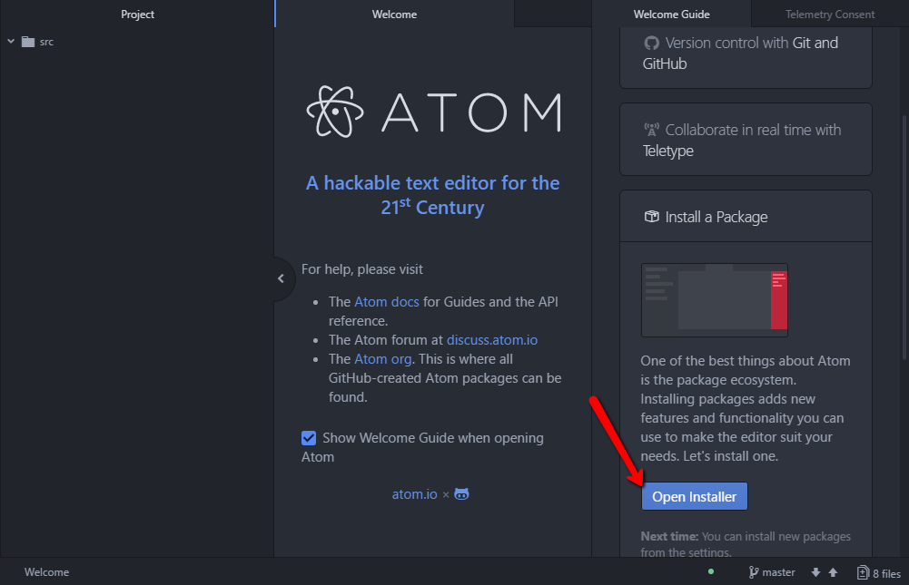
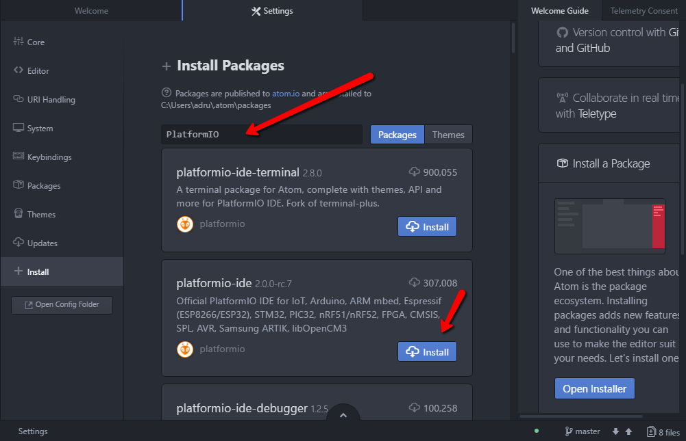
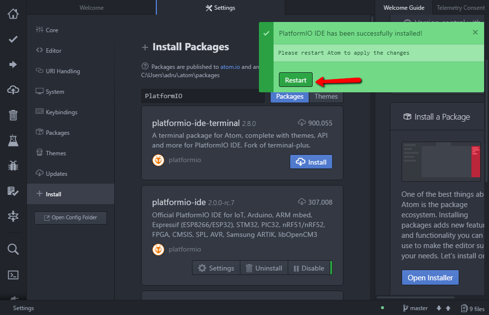
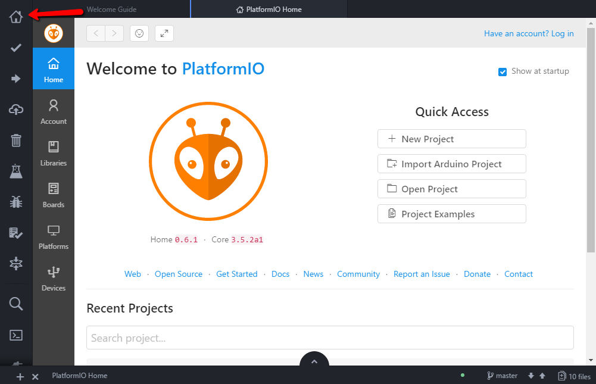
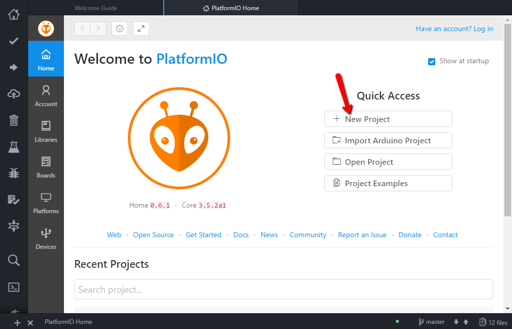
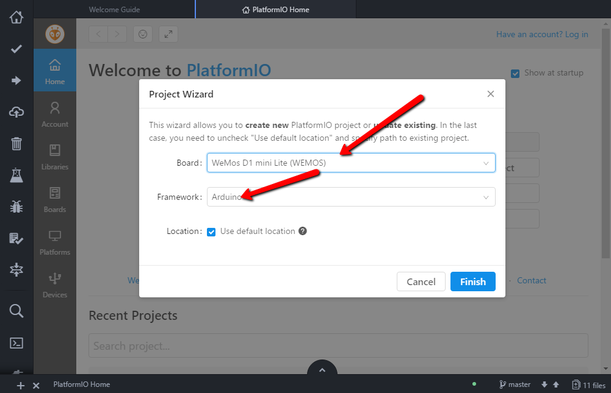
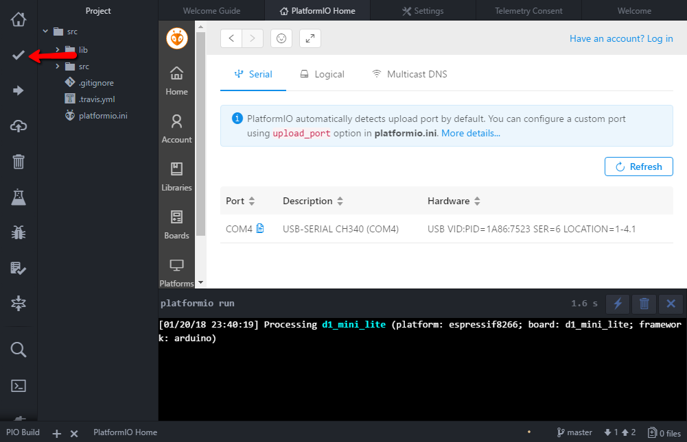

# luad-button

## 
W nawiązaniu do Gali IoT, która odbyła się 2017-12-02 na Błatniej, chciałbym rozwinąć temat i przedstawić przykładowe składowe rozwiazania problemu (tresc zadania: [tutaj](https://gitlab.jcommerce.pl/IoT/blatnia-2017-zadanie)). Tak, Tak nie zobaczycie tu całego rozwiązania, jedynie klocki z których możecie je poskładać :)
Poniżej przedstawię tochę informacji na temat samego sprzętu oraz jak rozwiązać poszczególne problemy zadania. Po przeanalizowaniu wszystkich elemetów będziecie w stanie samemu rozwiązać zadanie.

## Troche o hardware
Łukasz udostępnił wam urządzenie posiadające płyte główną [D1-Mini](https://wiki.wemos.cc/products:d1:d1_mini) oraz przycisk umieszczony w shield 1-BUTTON Shield v2.0.0. Sercem płyty głównej, z która mogliście się zmierzyć jest mikrokontroler [ESP8266](esp8266.md)

## Co musimy zrobić
* W wersji podstawowej zadania musimy:
0. [Uruchomić środowisko deweloperskie](#Dev)
1. [Zapalić diodę na urządzeniu](#Led)
2. [Podjać akcję po zdarzeniu double click](#Button)
3. [Podłączyć się do sieci WiFi](#WiFi)
4. [Wysłać request https](#Http)

## Srodowisko developerskie
Rozwiązanie przedstawię przy użyciu [Atom](https://atom.io/)(alternatywnie można wybrać [VS Code](https://code.visualstudio.com/), jednak zdarzają się problemy) oraz [PlatformIO](http://platformio.org/).

Instalacja jest szybka i bezbolesna :D

- Instalujemy [Atom](https://atom.io/)
- Instalujemy [PlatformIO](http://docs.platformio.org/en/latest/ide/atom.html)

    
    

- Restart [Atom](https://atom.io/)

    

- Po restarcie i chwili ładowania powinniśmy zobaczyć ekran domowy [PlatformIO](http://docs.platformio.org/en/latest/ide/vscode.html)

    

- Tworzymy nowy projekt [PlatformIO](http://docs.platformio.org/en/latest/ide/atom.html)

    

- Wybieramy płytę [D1-Mini](https://wiki.wemos.cc/products:d1:d1_mini) oraz framework [Arduino](https://www.arduino.cc)

    

- Podłączamy urządzenie (mrugnie niebieska dioda na urzadzeniu) i na liscie urządzeń możemy sprawdzić pod jakim portem COM nasze urządzenie jest dostępne

    

- Kompilujemy projekt, tak na wszelki wypadek żeby dociągnąć wszystkie zalećności i upewnić się, że wszystko działa

    
