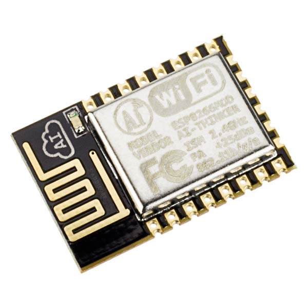

### ESP8266

- 32-bit RISC CPU: Tensilica Xtensa LX106 pracuje na częstotliwości 80 MHz 
    - mniej wiecej odpowiada predkosci procesorow [Intel P5](https://en.wikipedia.org/wiki/Pentium#Pentium) z 1993
- 64 KB wykładowy RAM, 96 KB danych RAM
- Zewnętrzna QSPI flash - 512 KiB do 4 MIB  (maksymalnie 16 MiB jest obsługiwany)
- IEEE 802.11 b / g / n Wi-Fi
- 16 GPIO (General Purpose Input/Output)
    - piny ogolnego przeznacznia do ktorym mozemy podlacyc kolejne urzadzenia
    - dwa tryby dziania
        - cyfrowy (DIGITAL) mozemy wyswic/odczytac stan wysoki lub niski
        - analogowy (ANALOG) mozemy wyswic/odczytac wartosci z przedzialu -3.3V do +3.3V (sprawdzic)
    - mozemy wykorzystac np. do zapalenia diody (3.3V), odczytania stanu przycisku, wysterowania przekaznika
    - czesc z GPIO dedykowanych jest do specjalnych zadan
- SPI (Serial Peripheral Interface)
    - interfejs szeregowej komunikacji synchronicznej 
    - dedykowane GPIO 13,12,14,15
    - wykorzystywany miedzy innymi do komunikacji z modulami pamięci EEPROM, flash
    - jak skorzystac z tego interfejsu mozecie dowiedziec sie [tutaj](https://github.com/JiriBilek/WiFiSpi)
- I²C (Inter-Integrated Circuit)
    - dwukierunkowa szeregowa szyna komunikacji
    - dedykowane GPIO 4 - SDA, GPIO 5 - SCL
    - wykorzystywana na przyklad do komunikacji z czujnikami
    - przyklad komunikacji [d1 mini z czujnikiem temperatury](http://www.esp8266learning.com/esp8266-si7021-temperature-sensor-example.php)
- UART (Universal Asynchronous Receiver-Transmitter)
    - asynchroniczne przekazywanie i odbieranie informacji
    - PIN 21 - RX, PIN 22 - TX
    - popularny Port Szeregowy, COM znany z PC
    - !!! UWAGA !!! ESP8266 dziala w przedziale napiecia od -3.3V do +3.3V, natomiast COM w PC od -25V do +25V, podlaczenie bez konwertera grozi spaleniem ukladu